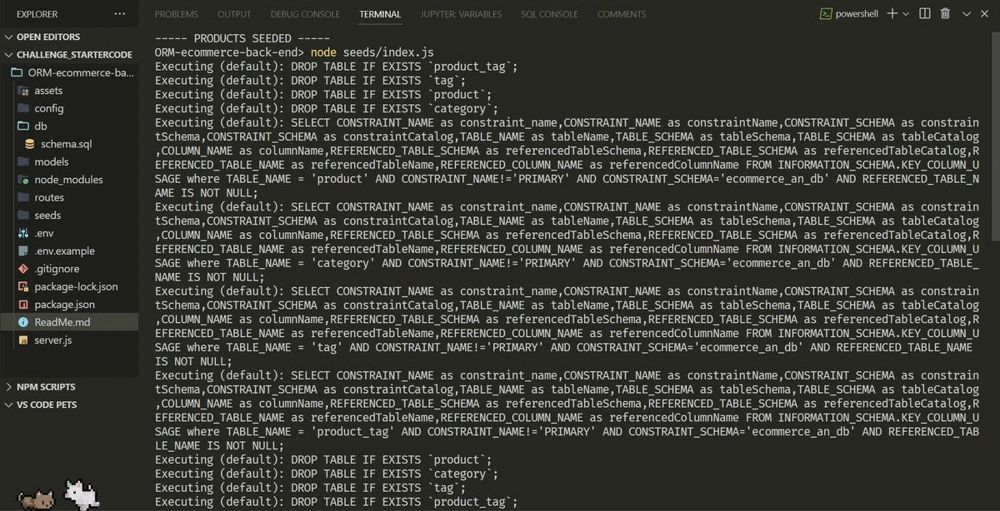
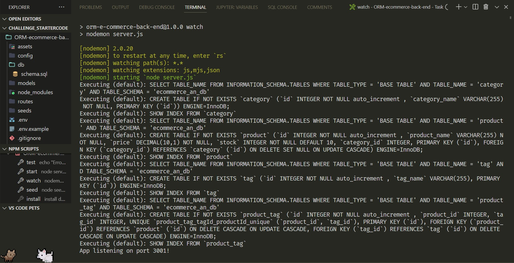
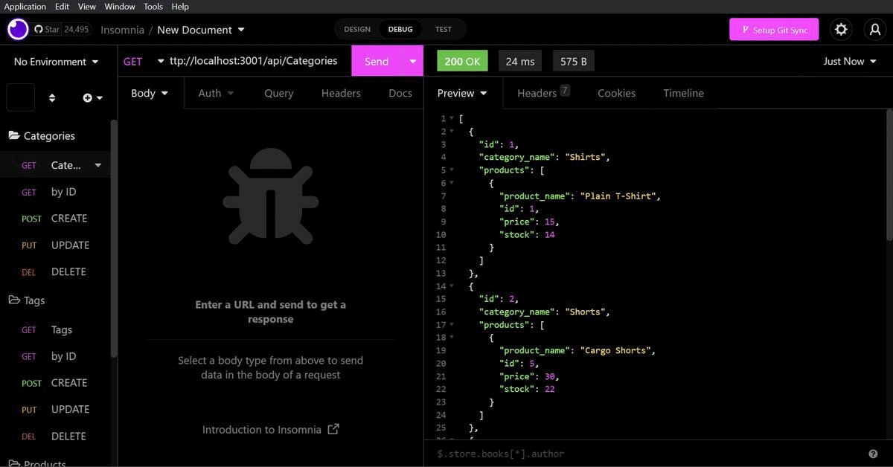
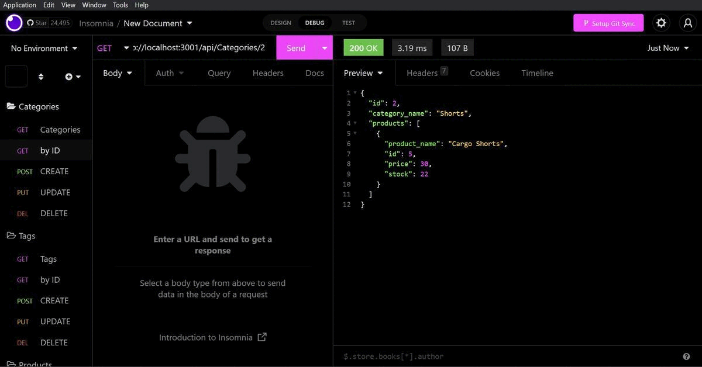
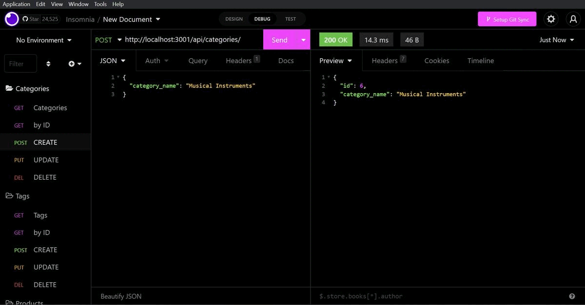
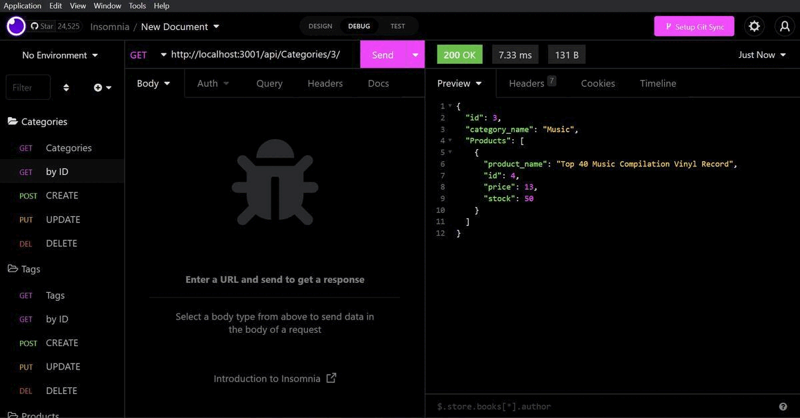
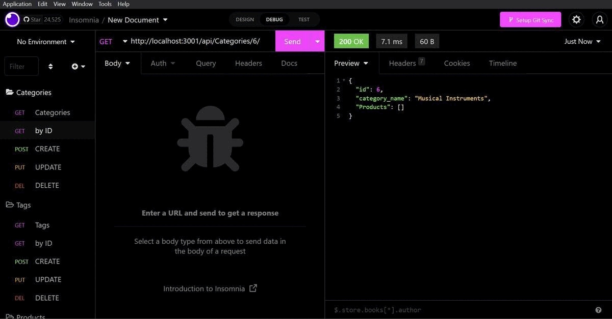

# 
 🏷️**Object-Relational Mapping (ORM) E-commerce back-end** 

---

## 
 _Description_ 📝

Building the back end for an e-commerce site using Express.js API and configuring it to use Sequelize to interact with MySQL database.

## 
 _Languages Used_ 💬

Javascript, Express.js, Sequelize, MySQL database

---

## _Table of Contents_ 📖

- [Installation](#Installation) 💾
- [Usage](#Usage) 🖥️
- [Links](#Links) 📎
- [Credits](#Credits) 💳
- [Licence](#Licence) 🪪
- [Badges](#Badges) 🦡
- [Questions](#Questions) ❓
- [Tests](#Tests) 🧪

---

## Installation 💾

- `npm i` (to get node-modules `dependencies(nodemon as dev, dotenv, express, mysql2, sequelize)` folder and package-lock.json file from package.json).

- Next run `node seeds/index.js` to get all the database info synced for use.

- `mysql -u root -p` > `show databases;`, `show tables;` and `SELECT * FROM (table name);` (to confirm that the database is seeded and tables are populated with desired data) > `source db/schema.sql`(to initiate the database) > `\quit`.

  

- Last but not the least, `npm run start` to start the server. Or, with nodemon installed as dev dependency, `npm run watch`.
  
  

- external software needed to showcase the results: Insomnia.

## *Usage* 🖥️

- Open Insomnia and:

- Type in `http://localhost/api/` (under GET, POST, PUT & DEL) followed by `categories` or `Tags` or `Products` to view details related to each.

  (To view the above mentioned install and usage process please take a look at this quick/short [walkthrough video](https://drive.google.com/file/d/1gwBEmskxJqLd5xgNgMLJQgByz1yd0DAg/view 'Below is a list of GIF representations of the categories results in insomnia shown in the video.'))

- To GET each of the three:
  

- To GET each by ID:
  

- To POST (create/insert):
  

- To PUT (update):
  

- To DEL (delete/destroy):
  

## *Links* 📎

Github repo and deployed Links

- <https://github.com/A-N26/ORM-e-commerce-back-end>

- No deployed link for this one.

## *Credits* 💳

class sessions, Starter-code and google&youtube

## *License* 🪪🦡

(**Please Click the BADGE for the license details.**)

## *Badges* 🦡

     

## *Questions* ❓

If you would like to as me anything (ama) about the project, please contact me on the info mentioned below:

Contact Me ✉️

- [My GitHub Profile](https://github.com/A-N26)

- e-mail - [📧](A-N26@github.com)

## *Contributing*

Please do not hesitate to fork this repo. And, there-after, create a new branch and commit, push that branch and create a pull request.☻

## *Tests* 🧪

No testing currently implemented.
